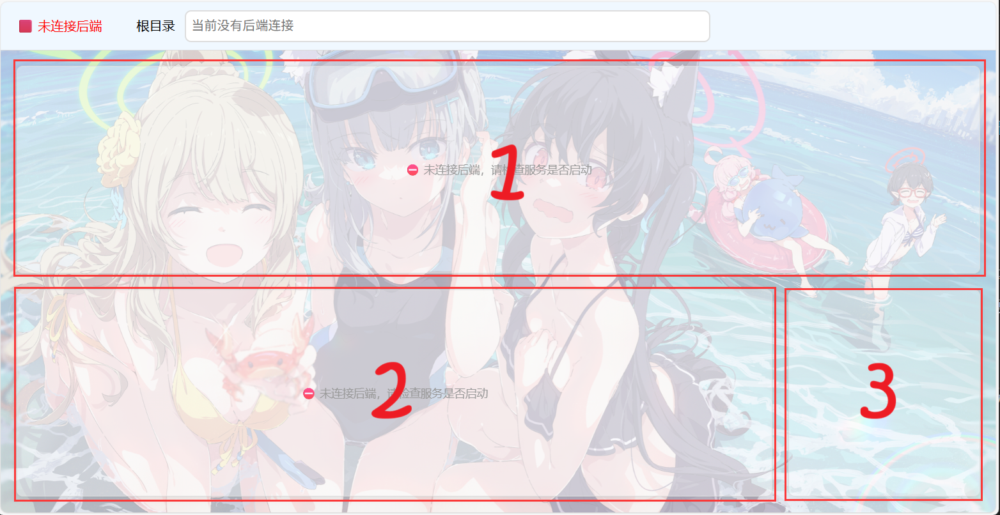

***

# 仓鼠存储管理器（ROLAND 版本）

仓鼠存储管理器是自写自用的一款面向仓鼠党的存储分类管理器，用于轻易的定制化管理私人拥有的本地大量资源。该软件以轻量、快速、定制化且易于拓展为原则，采用前后端html/python3分离架构。ROLAND版本是其中前端后端必须在同台设备上运行的版本(本地版)。

本项目仍在持续开发中，其基础功能还未完成。

 

classify\_shower模块页面截图，番剧的详情页页面，这里以无职2这部番为例。

classify\_shower模块页面截图，番剧的播放页页面。可以从中看到已经保存到本地的弹幕和b站评论。

## 开始使用

## 模块设计

仓鼠存储管理器的所有功能都来自于其上的各种模块，自身仅提供运行这些模块的平台，甚至具体界面都由模块决定(布局模块)。管理器可以加载两种类型的模块：功能模块和布局模块。这些模块可以像加模组一样随意更换（甚至很容易的开发新模块）以实现最高的个人定制化。

### 布局模块

布局模块管理着管理器的界面，是专职布局管理的最基础的模块。仓鼠存储管理器只能加载一个布局模块。这种模块负责将屏幕空间分成多个区域以实现布局管理，后续实现功能的功能模块可以从中获取一个或多个区域以在其上绘制其各自的功能页面。

 

以项目默认的布局模块 `frontend/frame.js` 为例，布局模块将屏幕空间分成了3个区域窗口。

 

### 功能模块

仓鼠存储管理器的所有功能都来自功能模块，功能模块使用仓鼠存储管理器提供的各种接口来实现其功能。一个功能模块由 js 脚本构成的前端部分和 py 脚本构成的后端部分组成（如果愿意，后端可以是其他形式只要符合本模块通信协议和接口规范即可，使用py主要是出于易于开发和跨平台的需要）。一个功能模块仓鼠存储管理器可以加载多个功能模块，每个功能模块都有属于自己的界面区域。

 

本项目目前已包含treemap、classify\_shower这两个默认功能模块以及一个简易的布局模块（位于 `frontend\frame.js`）。关于管理器与功能模块和布局模块的协作模式详细信息以及怎么编写这两种模块，详见[模块设计](./docs/总设计文档/模块化设计思路.md)。

## 目录概览

- `frontend/`：各种模块的前端部分。
- `backend/`：仓鼠存储管理器的主后端及各种功能模块的后端部分、配置文件。
- `工具链/`：与模块配套的工具；
- `关联项目/`：一些功能的实验代码。
- `docs/`：设计文档与功能添加记录文档；
- `build/`：发布文件清单与构建脚本。

## 许可证

除另有注明的第三方组件和资源外，本项目以 [GNU General Public License v3.0](./LICENSE) 发布。分发修改版本时，请同时遵守 GPL-3.0 及各第三方组件自身的许可证要求。

另外软件背景图 `./back.png` 取的是 pixiv 画师[荻pote](https://www.pixiv.net/users/2131660) 的作品，作品ID 110239446。作品仅供测试使用，实际使用时可以依照自己爱好替换。
