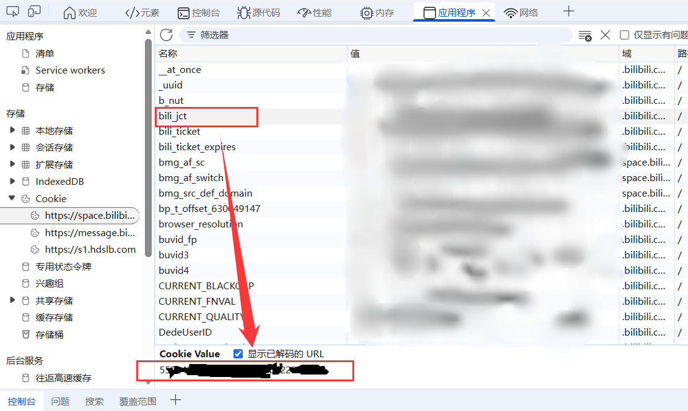
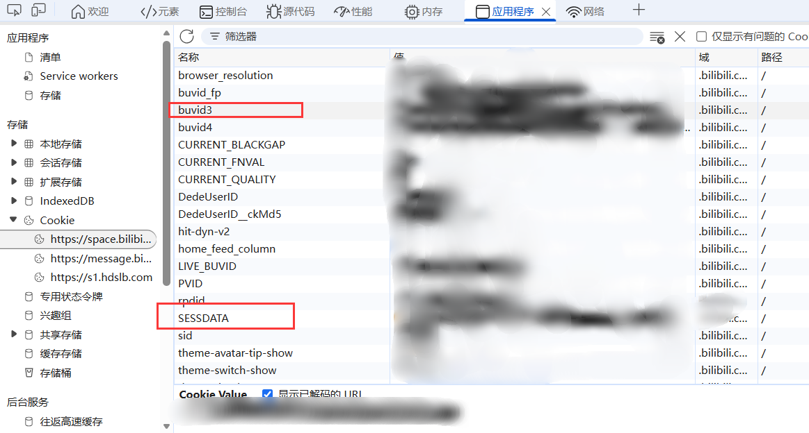

# 弹幕资源批量更新工具使用说明

本工具用于批量更新本地视频的 B 站弹幕数据，由两个脚本组成：

- **srcURL-build.py**：根据 B 站视频网址创建或更新弹幕来源文件 **dm-srcURL.json**。
- **srcURL-downloader.py**：按照 **basepath.json** 批量下载弹幕，并合并生成播放器实际读取的弹幕文件和时间轴重映射配置。

工具目录中自带经过精简的 **bilibili\_api**。运行脚本时应先把当前工作目录切换到本工具目录，避免脚本找不到配置文件，或误用其他位置的同名 Python 包。

## 一、运行环境

建议使用 Python 3.8 或更高版本。脚本使用的第三方包包括：

```
httpx
aiohttp
colorama
pycryptodomex
```

如本机尚未安装，可执行：

```
python -m pip install httpx aiohttp colorama pycryptodomex
```

进入工具目录：

```
cd /d "仓鼠存储管理器_brch3\工具链\弹幕资源批量更新工具"
```

实际使用时请换成本机项目的完整路径。

## 二、准备 B 站登录凭证

在工具目录中新建 **cookie.json**：

```
{
    "SESSDATA": "这里填写 SESSDATA",
    "bili_jct": "这里填写 bili_jct",
    "buvid3": "这里填写 buvid3"
}
```

这些值来自已登录 B 站账号的浏览器 Cookie。Cookie 属于账号凭证，请勿发送给他人或提交到 Git 仓库。具体的获取方法可以打开浏览器的开发者工具，找到 **应用** -> **Cookie**，复制 **SESSDATA**、**bili\_jct**、**buvid3** 这三个值，如图所示。




**cookie.json** 中的凭证失效、字段缺失时，将不能获取到全部弹幕数据。若账号无权访问目标视频时，网址解析或弹幕下载会失败。

## 三、使用 **srcURL-build.py** 为单个视频建立弹幕来源

### 1. 确定视频元数据目录

对于 `classify_shower` 模块，本地视频 **xxx.mp4** 对应的元数据目录为同级的 **xxx.files**：

```
某个目录/
├── xxx.mp4
└── xxx.files/
```

构建完成的来源文件 **dm-srcURL.json** 最终应放入这个 **xxx.files** 目录。

### 2. 运行来源构建脚本

在工具目录执行：

```
python srcURL-build.py
```

脚本会读取当前目录的 **cookie.json**，并根据你提供的b站网址创建或更新当前目录下的 **dm-srcURL.json**。如果文件已经存在且内容有效，脚本会显示已有来源并在其后追加，不会主动删除旧来源。

支持以下形式的网址：

```
https://www.bilibili.com/video/BVxxxxxxxxxx
https://www.bilibili.com/video/BVxxxxxxxxxx?p=2......
https://www.bilibili.com/bangumi/play/ep123456?......
```

每次添加来源时，脚本会自动分配 **dm1**、**dm2** 等不重复名称，并询问是否配置时间轴重映射。相同的 BV 号和分 P 号组合不会重复加入。构建完成后将生成的 **dm-srcURL.json** 拖到目标视频的 **xxx.files** 目录里即可。若要给多个本地视频配置弹幕，应分别准备各自的来源文件。

### 3. 配置时间轴重映射

`classify_shower` 模块的视频组件不仅支持融合不同开源同一视频的弹幕，对每个来源的弹幕还支持配置时间轴重映射，使得加载的弹幕与本地视频的时间轴对齐。如果 B 站视频与本地视频内容完全一致，在“是否需要重映射时间轴”处直接按 Enter 即跳过该步骤。

最后生成的 **dm-srcURL.json** 文件内容示例：

```
[
    {
        "src": "B站",
        "BV": "BVxxxxxxxxxx",
        "p": 1,
        "name": "dm1",
        "rmcf": {
            "dmsrc-file": "dm1.json",
            "time_filter": [],
            "cut_time": 0,
            "add_time": [],
            "add_time_text": "(此处为B站删减片段)"
        }
    }
]
```

一般不需要手工修改。如果手工编辑，**name** 与 **rmcf.dmsrc-file** 应保持对应，例如来源名 **dm2** 对应 **dm2.json**。

## 四、使用 **srcURL-downloader.py** 批量下载弹幕数据

### 1. 准备任务清单

在工具目录中新建任务清单 **basepath.json**。其顶层必须是列表，每一项都是一个需要更新的 **xxx.files** 目录，而且已经将之前生成的 **dm-srcURL.json** 放入了该目录。**srcURL-downloader.py** 会根据每个 **xxx.files** 目录下的这个文件批量下载弹幕数据到这个目录。

以 Windows 本地路径为例，**basepath.json** 可以是：

```
[
    "D:\\视频\\番剧\\第一集.files",
    "D:\\视频\\番剧\\第二集.files"
]
```

UNC 网络共享路径示例：

```
[
    "\\\\NAS-SERVER\\video\\番剧\\第一集.files"
]
```

JSON 字符串中的反斜杠必须写成两个反斜杠。也可在 Windows 路径中使用正斜杠，以减少转义错误：

```
[
    "D:/视频/番剧/第一集.files",
    "D:/视频/番剧/第二集.files"
]
```

**basepath.json** 是本机任务清单。

### 2. 运行下载器

确认工具目录中同时存在：

```
cookie.json
basepath.json
srcURL-downloader.py
bilibili_api/
```

还要确认 **basepath.json** 中的每个元数据目录都包含 **dm-srcURL.json**，然后执行：

```
python srcURL-downloader.py
```

程序首先询问“下载完成后是否需要自动构建弹幕目录？”：

- 直接按 Enter：每个目录下载结束后自动合并弹幕并更新 **rmcf.json**，全程不需要手动干预，正常情况下程序会自动完成 **basepath.json** 中所有目录的构建。
- 输入任意内容：每个目录下载完成后再次询问是否手动构建；届时直接按 Enter 执行构建，输入任意内容则跳过。

下载器会依次处理任务清单中的目录和每个来源。为减小连续请求压力，各来源处理后会等待约 2 秒。

### 3. 更新弹幕目录

第一次下载后的典型结构：

```
xxx.files/
├── dm-srcURL.json
├── raw/
│   ├── dm1.json
│   └── dm2.json
├── dm1.json
├── dm2.json
└── rmcf.json
```

然后你可以保留本次使用的 **basepath.json** ，一段时间后再次运行来更新现在的弹幕数据。
如果这段时间有些弹幕被删掉了，那么最后的合并结果仍然会包含这些弹幕。
再次运行后，**raw** 目录会包含新的弹幕快照：

```
raw/
├── dm1.json
├── dm1-2.json
├── dm1-3.json
├── dm2.json
└── dm2-2.json
```

各文件含义：

- **raw/dm1.json**、**raw/dm1-2.json** 等：该来源历次下载的原始弹幕快照。
- **dm1.json**、**dm2.json** 等：对应来源所有历史快照与既有合并文件去重后的最终弹幕。
- **rmcf.json**：各最终弹幕文件对应的时间轴重映射配置。
- **dm-srcURL.json**：下载来源和重映射设置，是以后再次更新时的输入。

播放器会在读取弹幕时生成 **dm-info.json** 弹幕来源汇总信息，这个文件是用来在番剧展示页面显示弹幕来源等各种信息的。

## 五、弹幕合并和去重规则

构建阶段会读取：

1. **raw** 目录中同一来源的所有历史 JSON；
2. **xxx.files** 根目录中已有的同名最终弹幕 JSON。

随后重新生成最终文件：

- 若历次数据的 **oid** 一致，按弹幕的 **dmid** 去重。
- 若检测到同一名称的来源曾更换 **oid**，程序会显示黄色警告，并改用“视频时间 + 弹幕文本 + 发送时间”组合去重。
- 新下载中暂时缺少的旧弹幕不会从最终文件删除，因此最终文件保存的是历次抓取结果的并集。

**raw** 用于保留历史快照。空间不足时可以删除，下次运行会重新创建；但删除后将失去这些原始历史版本。根目录中已有的最终弹幕文件仍会参与下一次合并。

## 八、常见问题

### 提示 cookie.json 文件不存在

脚本按当前工作目录查找文件。请先进入工具目录再运行，并确认文件名不是 **cookie.json.txt**。

### 提示找不到 basepath.json

请在工具目录创建该文件，并确保内容是合法 JSON 列表。路径中的反斜杠需要双写。

### 提示路径不存在或 dm-srcURL.json 不存在

检查任务清单填写的是否为实际 **xxx.files** 目录，并确认其中存在来源文件。

### B 站网址解析失败

确认网址属于脚本支持的 BV 视频页或 ep 番剧播放页，Cookie 仍然有效，并尝试移除网址中的多余参数。

### 下载失败或显示“稿件已失效”

可能是稿件删除、区域限制、权限不足、Cookie 失效或网络请求超时。确认浏览器中使用同一账号可以访问目标视频后再重试。

### 出现弹幕源发生更换的黄色警告

表示同一 **dm1**、**dm2** 名称下的历史文件包含不同 **oid**。程序仍会构建，但会切换去重策略。应检查来源文件是否误把新的无关视频沿用了旧来源名称。

### rmcf.json 损坏

程序会询问是否用新列表覆盖。直接按 Enter 会放弃损坏内容并重建；输入任意内容则跳过本次 **rmcf.json** 构建。覆盖前如需排查，请先备份原文件。

## 九、推荐流程

1. 在工具目录准备有效的 **cookie.json**。
2. 运行 **srcURL-build.py**，为一个视频录入来源。
3. 把生成的 **dm-srcURL.json** 放入该视频的 **xxx.files**。
4. 对其他视频重复第 2～3 步。
5. 把所有需要更新的 **xxx.files** 路径写入 **basepath.json**。
6. 运行 **srcURL-downloader.py**，直接按 Enter 选择自动下载与构建。
7. 查看每个目录的日志，尤其留意失败提示和来源更换警告。
8. 打开 classify\_shower 播放视频，确认弹幕加载和时间轴映射效果。

